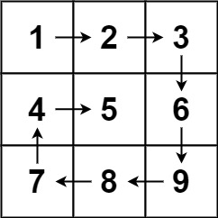

# Pascal's Triangle #118
- Given a number of rows, we will generate a list containing arrays that hold values of Pascal's triangle
  - Ex: where numRows = 5 we would get [[1], [1,1], [1,2,1], [1,3,3,1], [1,4,6,4,1]]
- We will solve this through a recursive implementation utilizing a hashmap for memoization.
- Time Complexity: O($n^2$)
- Space Complexity: O($n^2$)

# Spiral Matrix #54
- Given a `m x n` matrix, we want to return all the elements inside the matrix in a spiral order
  - Ex: matrix = [[1,2,3], [4,5,6], [7,8,9]], output returned would be [1,2,3,6,9,8,7,4,5]
  - Picture to showcase 
  - 
- To solve this we will traverse the matrix in a spiral pattern through layers, where each layer is traversing the perimeter of the remaining submatrix in which we will collect the elements into a list
- Time Complexity: O(N * M)
- Space Complexity: O(N * M)